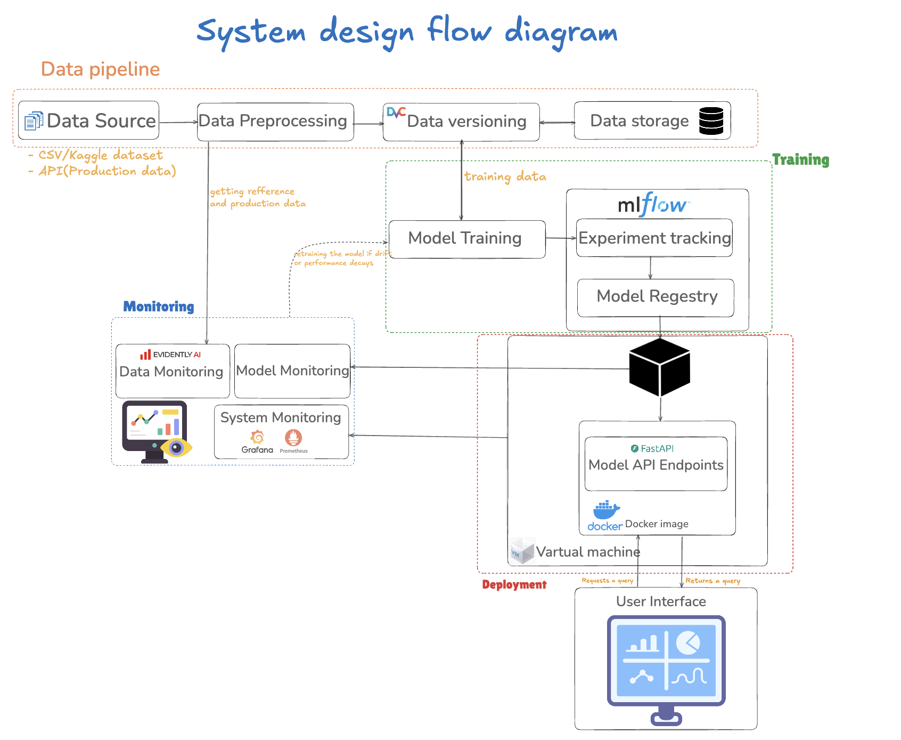

#  Real-Time Customer Churn Prediction System (MLOps Project)

##  Overview
This project implements a **real-time customer churn prediction system** for a telecommunications company, following **end-to-end MLOps best practices**.  
The goal is to predict whether a customer will churn based on behavioral and demographic features, with **automated data pipelines, experiment tracking, CI/CD workflows, deployment, and monitoring**.

Customer churn is the phenomenon where customers discontinue their relationship with a company which poses a significant challenge to the telecommunications industry. High churn rates can lead to substantial revenue losses, reduced market share and hindered long-term growth. Therefore, accurately identifying customers who are likely to churn and intervening before they leave is critical for maintaining business stability and profitability.

This project focuses on building a Real-Time Customer Churn Prediction System powered by Machine Learning Operations (MLOps). The solution will continuously analyze customer data to predict churn probability and suggest what lead to it in real time. By integrating automated data pipelines, model retraining workflows, CI/CD orchestration, and inference APIs, the system ensures that predictions remain accurate, reliable and actionable.


The system integrates:
- Automated **data ingestion and preprocessing**
- **Model training and versioning** with MLflow and DVC
- **Continuous Integration & Deployment (CI/CD)** using GitHub Actions
- **FastAPI-based REST API** for model serving
- **Monitoring** with Prometheus and Airflow DAGs for drift and decay detection
- **Containerization** with Docker and deployment on **Azure Cloud**

---

## 🏗️ System Architecture / System Design Flow Diagram
The overall architecture consists of multiple interconnected components supporting the full machine learning lifecycle.



**Main Components:**
1. **Data Pipeline** – handles ingestion, cleaning, feature engineering, and data versioning.
2. **Model Development** – builds and evaluates multiple ML models with experiment tracking.
3. **CI/CD Pipeline** – automates testing, retraining, and deployment.
4. **Model Serving** – exposes predictions via a FastAPI REST endpoint.
5. **Monitoring & Feedback** – observes model performance, drift, and triggers retraining.

---

##  Technical Stack

| Category | Tools / Frameworks |
|-----------|--------------------|
| **Language** | Python 3.12 |
| **ML Libraries** | Scikit-learn, XGBoost, Joblib |
| **Experiment Tracking** | MLflow |
| **Data Versioning** | DVC |
| **API Framework** | FastAPI |
| **Orchestration** | Apache Airflow |
| **Monitoring** | Prometheus + Grafana |
| **Containerization** | Docker & Docker Compose |
| **Cloud Platform** | Microsoft Azure |
| **CI/CD** | GitHub Actions |
| **Dependency Management** | requirements.txt |

---

##  Data Pipeline

The dataset used: [`WA_Fn-UseC_-Telco-Customer-Churn.csv`](data/raw/)

**Pipeline Steps:**
1. **Data Ingestion** (`src/data_pipeline/data_ingestion.py`)  
   - Reads data from CSV sources  
   - Validates schema and missing values  
   - Logs ingestion process  

2. **Preprocessing** (`src/data_pipeline/data_preprocessing.py`)  
   - Cleans missing and categorical data  
   - Encodes categorical variables (`label_encoder.joblib`)  
   - Normalizes numerical features (`scaler.joblib`)  

3. **Feature Engineering** (`src/data_pipeline/feature_engineering.py`)  
   - Creates customer usage and tenure-related features  
   - Saves processed data to `data/processed/`  

4. **Data Versioning**  
   - Managed through **DVC**, ensuring reproducibility of data and model artifacts  

---

##  Model Development

Model development occurs in the `src/modeling/` directory.

**Models Trained:**
- Logistic Regression  
- XGBoost  
- Neural Network (`nn_model.py`)

**Configuration File:**  
`model_config.yaml` defines hyperparameters, training parameters, and thresholds.

**Tracking:**
- **MLflow** is used to log metrics (Accuracy, F1-score, AUC) and model versions.
- Model artifacts and parameters are stored for reproducibility.

**Best Model Selection:**
- Models are compared based on **F1-score** and **AUC**.
- The final model is serialized and stored in `data/models/`.

---

##  CI/CD Pipeline

Implemented via **GitHub Actions**.

**Workflow Features:**
- Automatically triggered on code commits or pull requests.  
- Runs **unit tests** (e.g., `test/test_data_pipeline.py`) to validate data logic.  
- Performs **integration tests** to verify pipeline execution.  
- Triggers **model retraining** when new data is detected via DVC or Airflow.  
- Builds and deploys Docker containers for the API.

**Airflow DAGs:**
- `canary_deployment.py`: Gradually rolls out new model versions (5% → 25% → 100%).  
- `model_decay_data_drift.py`: Detects model degradation or drift and triggers retraining.

---

##  Deployment

Deployment is managed via **Docker** and **Azure Cloud**.

**Files:**
- `Dockerfile.fastapi`: Builds the FastAPI inference container  
- `Dockerfile.airflow`: Sets up Airflow for orchestration  
- `docker-compose-1.yml`, `docker-compose-2.yml`: Define service orchestration  

**FastAPI Application:**
- Located in `src/app/main.py`  
- Exposes endpoints for model prediction, retraining, and health checks  
- Includes authentication (`auth.py`) and configuration management (`config.py`)

Example Endpoint:
```bash
POST /predict
Content-Type: application/json
